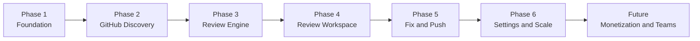
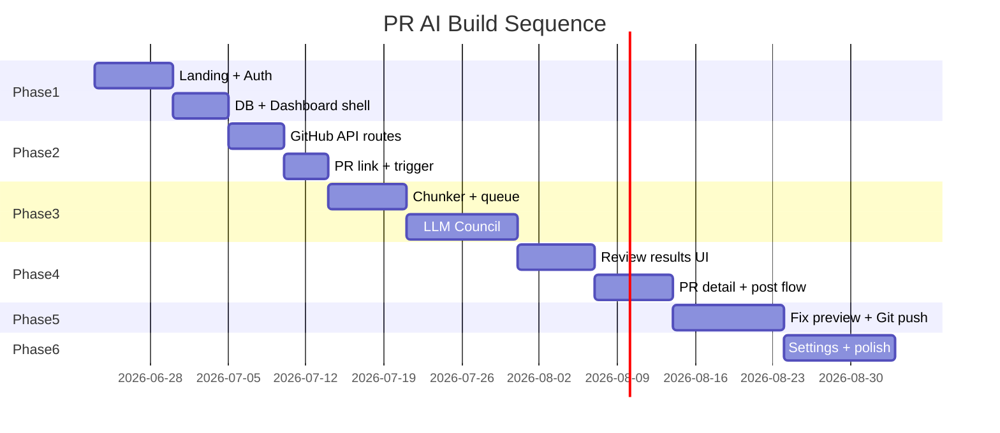

# PR AI — Phased Implementation Roadmap

**Document Version:** 1.0  
**Status:** Draft  
**Last Updated:** June 22, 2026  
**Source:** [PR-AI-PRD.md](./PR-AI-PRD.md) · [mockups/v3.html](../mockups/v3.html)

---

## Overview

This document breaks PR AI into **six delivery phases**. Each phase is shippable on its own and builds on the previous one. Phases are ordered by dependency and user value — you cannot review a PR until auth and GitHub integration exist, and you cannot post fixes until the review engine produces comments.

The mockup (`v3.html`) introduces one important UX improvement over the raw PRD: **comments are staged inside PR AI first**, then the developer chooses when to post them to GitHub. That staged workflow is reflected in Phases 3 and 4 below.

---

## Phase Summary

| Phase | Name | Goal | PRD Milestone |
|---|---|---|---|
| **1** | Foundation & Auth | User can land, sign in, and reach a protected dashboard shell | M1 |
| **2** | GitHub Discovery | User can browse repos/PRs and trigger a review job | M2 |
| **3** | Review Engine | AI pipeline runs async and produces staged comments in the database | M3 (backend) |
| **4** | Review Workspace UI | User inspects findings, views diffs, and posts comments to GitHub | M3 (frontend) + mockup |
| **5** | Fix and Push | User previews AI fixes and commits them via Git Data API | M4 |
| **6** | Settings, Guardrails & Polish | BYOK, billing hook, observability, production hardening | M5 |

---

## Phase 1 — Foundation & Auth

**Goal:** A developer can visit PR AI, understand the product, sign in with GitHub, and land on a protected dashboard shell.

### Features

| Feature | Description | PRD IDs |
|---|---|---|
| **Marketing landing page** | Hero, value props (Security / Performance / Code Quality), "How it works" timeline, CTA to sign in | — (mockup: Home screen) |
| **GitHub OAuth sign-in** | Auth.js flow with `repo` scope; sign-out clears session | AUTH-1, AUTH-2 |
| **Encrypted token storage** | GitHub access token encrypted at rest in PostgreSQL | AUTH-3 |
| **Session-protected routes** | Dashboard, review, and settings routes require auth | AUTH-5 |
| **App shell & design system** | GitHub-inspired dark theme, header, sidebar nav skeleton, shared components (cards, badges, buttons) | NFR-UX-4 (mockup) |
| **Database schema (core)** | `User`, `GitHubToken` tables; migration setup | Data model |
| **Dashboard shell** | Sidebar: Dashboard, Review history, PR details, Settings — content placeholders OK | DASH-1 |

### Mockup alignment

- Home screen: hero, feature cards, timeline steps
- Sign-in screen: centered card, "Authenticate with GitHub" CTA
- Dashboard sidebar layout (nav items only; data comes in Phase 2)

### Exit criteria

- [ ] Unauthenticated user sees landing page and can click through to sign in
- [ ] Authenticated user sees dashboard with GitHub avatar/username
- [ ] Token stored encrypted; never returned to client
- [ ] Protected routes redirect unauthenticated users to sign in

### Out of scope for Phase 1

- Repo/PR listing, review triggers, AI pipeline, settings page content

---

## Phase 2 — GitHub Discovery & Review Trigger

**Goal:** A signed-in developer can find a PR (via repo browser or pasted link) and enqueue a review job.

### Features

| Feature | Description | PRD IDs |
|---|---|---|
| **Repository listing** | Fetch and display user repos with pagination | REPO-1 |
| **Open PR listing** | Selecting a repo loads open PRs with title, number, author, branch, status | REPO-2, REPO-3 |
| **Direct PR link input** | Prominent URL field on dashboard; regex parses `github.com/{owner}/{repo}/pull/{number}` | PR-LINK-1, PR-LINK-2 |
| **URL validation & access control** | Invalid URLs show inline error; unauthorized repos return 403 | PR-LINK-3, PR-LINK-4 |
| **Review trigger API** | `POST /api/review` enqueues job; returns job ID immediately | DASH-2, AI-CORE-5 |
| **Review history (basic)** | Dashboard lists past jobs with status: queued, in-progress, completed, failed | DASH-3 |
| **Billing middleware stub** | Pass-through on review routes; `checkSubscription()` stub returns `{ allowed: true }` | BILL-1, BILL-2, BILL-3 |
| **Token re-auth flow** | Expired/revoked GitHub tokens prompt re-authentication | AUTH-4 |

### Mockup alignment

- Dashboard: PR link input ("Pipeline Target Injection")
- Repo cards with open PR rows and status badges (Reviewed / In progress / Not reviewed)
- "Start review" and "View results" actions per PR row

### Exit criteria

- [ ] User can paste a valid PR URL and enqueue a review
- [ ] User can browse repos, pick a PR, and enqueue a review
- [ ] Job record created with `queued` status; API responds in < 500ms
- [ ] Review history shows job status updates (polling OK for MVP)
- [ ] Invalid URL and 403 cases show actionable error messages

### Out of scope for Phase 2

- AI processing, comment generation, diff UI, GitHub comment posting

---

## Phase 3 — Review Engine (Backend)

**Goal:** Enqueued jobs run through the LLM Council pipeline and persist vetted, line-level comments — ready for in-app staging (not yet posted to GitHub).

### Features

| Feature | Description | PRD IDs |
|---|---|---|
| **Diff fetch & filter (The Ignorer)** | Exclude lockfiles, configs, markdown, binaries from review payload | CHUNK-1, CHUNK-2 |
| **Diff chunking (The Chunker)** | Split large files at 150–200 line boundaries respecting function/class edges | CHUNK-3, CHUNK-4, CHUNK-5 |
| **Token metrics logging** | Log raw vs. filtered vs. chunked token counts per job | CHUNK-6 |
| **Agent 1 — Reviewer** | Four-axis analysis (Security, Performance, Code Quality, Test Suggestions) → structured JSON | AI-CORE-1, AI-CORE-2 |
| **Agent 2 — Scrutinizer** | Filters false positives, refines tone → vetted comment array | AI-CORE-3, AI-CORE-4 |
| **Background job queue** | Inngest or QStash worker; no heavy work in API route | AI-CORE-5, NFR-SCALE-2 |
| **Job status lifecycle** | `queued` → `chunking` → `reviewing` → `scrutinizing` → `completed` / `failed` | AI-CORE-6 |
| **Retry & failure handling** | 3 retries with exponential backoff; Scrutinizer fallback to Reviewer output | AI-CORE-7, NFR-REL-1, NFR-REL-3 |
| **Empty diff handling** | Graceful completion when all files are ignored | AI-CORE-8 |
| **AIServiceRouter (platform tier)** | Central router for all LLM calls; platform default key for MVP | AI-ROUTER-1, AI-ROUTER-2, AI-ROUTER-7 |
| **Comment persistence** | Store comments with `postedToGitHub: false` (staging default) | Data model, mockup |

### Mockup alignment (backend support)

- Comments exist in DB before any GitHub post — supports the "staging mode" workflow
- Job status drives dashboard badges: "In progress", "Reviewed"

### Exit criteria

- [ ] Triggered review completes end-to-end for a typical PR (< 500 LOC) in < 3 minutes
- [ ] Comments persisted with file path, diff position, axis, severity, body
- [ ] Token reduction ≥ 40% vs. raw diff on typical PRs
- [ ] Failed LLM calls retry; permanent failures logged with detail
- [ ] `GET /api/review/[jobId]` and `GET /api/review/[jobId]/comments` return correct data

### Out of scope for Phase 3

- Review results UI, diff rendering, GitHub comment posting, fix generation

---

## Phase 4 — Review Workspace UI

**Goal:** Developer inspects AI findings in a rich in-app workspace, then explicitly posts selected or all comments to GitHub.

> **Mockup improvement:** The PRD originally described auto-posting comments to GitHub. The v3 mockup stages comments in-app first with a **"Post all to GitHub"** action bar. This phase implements that staged workflow.

### Features

| Feature | Description | PRD IDs |
|---|---|---|
| **Review results screen** | Two-column layout: staged findings list + diff viewer with inline comment overlays | FIX-1 (diff display), mockup |
| **Comment cards** | File:line, axis badge, severity badge; click selects and scrolls diff | mockup: Staged Findings |
| **Review summary stats** | Comment count, critical/warning/info breakdown, token reduction % | mockup: stat cards |
| **Diff viewer** | Per-file diff with add/delete highlighting; inline AI comment blocks | mockup: diff-body |
| **Post bar & batch post** | "Post all to GitHub" triggers batch inline comment API; success notice with PR link | GH-COMMENT-1–3, mockup |
| **Diff position mapping** | Map AI `diffPosition` to GitHub diff index correctly | GH-COMMENT-2 |
| **GitHub rate limit handling** | 429 responses trigger queued retry | GH-COMMENT-5 |
| **Comment attribution** | Post as authenticated user or bot (resolve open question #1) | GH-COMMENT-4 |
| **PR detail workspace** | Full PR header, files-changed tab, per-file severity badges, sidebar metrics panel | mockup: PR detail screen |
| **Dashboard analytics** | Reviews this month, issues flagged, token reduction stat cards | mockup: stat-grid |
| **Review history page** | Dedicated sidebar view of all past reviews with links to results | mockup: sidebar nav |
| **Re-run review** | "Re-ignite Analysis" creates a new job for the same PR | mockup, NFR-REL-2 |
| **Real-time status updates** | Polling-based job status on dashboard and review screens | NFR-UX-2 |

### Mockup alignment

- Review screen: post bar, comment cards, diff with inline comments, "Synthesize Correction" entry point
- PR detail: files changed, inline comments with "View AI fix →" link, Matrix Metric Run sidebar
- Dashboard: monthly stats, repo cards, PR status badges

### Exit criteria

- [ ] Completed review opens results screen with all staged comments
- [ ] User can navigate findings ↔ diff context
- [ ] "Post all to GitHub" posts comments; `postedToGitHub` flags update; success notice shown
- [ ] PR detail view shows full diff context and links to fix flow
- [ ] Partial GitHub post failures reported without losing successful posts
- [ ] Dashboard stats reflect completed reviews

### Out of scope for Phase 4

- Fix generation, Git push, BYOK settings UI, payments

---

## Phase 5 — Fix and Push

**Goal:** Developer previews an AI-suggested fix for a flagged snippet and pushes it to the PR branch with one confirmed click.

### Features

| Feature | Description | PRD IDs |
|---|---|---|
| **Side-by-side fix preview** | Original snippet vs. AI-corrected snippet in two panels | FIX-1, mockup: fix-grid |
| **Targeted fix generation** | LLM receives only flagged snippet + critique; returns corrected code block | FIX-2 |
| **Entry from review/diff** | "Synthesize Correction" / "View AI fix →" navigates to fix preview | mockup |
| **Commit confirmation modal** | Shows branch, auto-generated commit message; user must confirm | FIX-7, mockup: modal |
| **Git Data API push** | Blob → tree → commit sequence without local clone | FIX-3, FIX-4 |
| **Auto commit message** | e.g. `fix(review): address security finding in auth.ts` | FIX-5 |
| **Conflict detection** | Fail with clear message if file SHA changed; no force push | FIX-6 |
| **Fix status tracking** | `FixSuggestion` record with push status | Data model |

### Mockup alignment

- Fix preview: before/after panels, target file/line header, commit modal with branch and message
- PR detail inline comments link to fix flow

### Exit criteria

- [ ] Fix preview generates in < 10 seconds per snippet
- [ ] User confirms in modal before any commit
- [ ] Successful push updates branch on GitHub with correct commit message
- [ ] Stale file SHA shows actionable "file modified" error
- [ ] Fix flow reachable from review results and PR detail views

### Out of scope for Phase 5

- BYOK, subscription limits, team features

---

## Phase 6 — Settings, Guardrails & Production Polish

**Goal:** Production-ready platform with user-configurable AI keys, billing hooks wired for future monetization, and operational guardrails.

### Features

| Feature | Description | PRD IDs |
|---|---|---|
| **Settings page** | Sidebar nav item with full settings UI | SETTINGS-1–4, mockup |
| **BYOK — API key management** | Add, update, delete OpenAI/Anthropic keys (encrypted at rest) | AI-ROUTER-3, AI-ROUTER-5, SETTINGS-1 |
| **Provider preference** | Choose OpenAI vs. Anthropic when both keys present | AI-ROUTER-6, SETTINGS-2 |
| **GitHub connection status** | Show connected account and token health | SETTINGS-3 |
| **Disconnect GitHub** | Revoke access and delete stored token | SETTINGS-4 |
| **Billing middleware contract** | Zero coupling in core engine; extensibility verified | BILL-4, BILL-5, NFR-MAINT-2 |
| **Per-user rate limits** | e.g. 10 review triggers/hour | NFR-SEC-6 |
| **Structured logging** | jobId, userId, repo, token counts, duration, status | NFR-OBS-1 |
| **Error tracking** | Sentry or equivalent integration | NFR-OBS-2 |
| **Cost tracking** | Per-job LLM token usage and estimated cost | NFR-OBS-3 |
| **Module boundaries** | Core engine, auth, billing, UI as separate modules | NFR-MAINT-1 |
| **Onboarding polish** | First review completable within 2 minutes of sign-up | NFR-UX-1 |
| **Responsive pass** | Desktop and tablet functional; mobile read-only acceptable | NFR-UX-4 |

### Exit criteria

- [ ] User can save BYOK keys; router uses them for subsequent reviews
- [ ] Settings show GitHub health; disconnect works
- [ ] Rate limit enforced with clear user message
- [ ] All review jobs emit structured logs and cost metrics
- [ ] Adding a mock subscription check to middleware requires zero core engine changes
- [ ] Platform meets NFR targets for security, reliability, and observability

---

## Future Phases (Post-MVP)

These are explicitly out of MVP scope in the PRD. Architecture is pre-positioned via billing middleware and module boundaries.

### Phase 7 — Monetization (Razorpay)

| Feature | PRD IDs |
|---|---|
| Subscription plans: Free / Pro / Team | BILL-FUTURE-1 |
| Middleware enforces tier limits before review enqueue | BILL-FUTURE-2 |
| `subscriptions` and usage metering tables | BILL-FUTURE-3, BILL-FUTURE-4 |
| Usage dashboard (reviews remaining this period) | — |

### Phase 8 — Team & Organization

| Feature | Description |
|---|---|
| Org-level accounts | Shared billing, member management |
| Team review history | Reviews visible across org members |
| Shared review rules | Org-wide ignore patterns and severity thresholds |

### Phase 9 — Platform Expansion

| Feature | Description |
|---|---|
| Custom review rule UI | User-configurable ignore patterns and analysis axes |
| Additional VCS providers | GitLab, Bitbucket |
| GitHub App bot | Dedicated bot identity for comment attribution |
| Demo / warp mode | "View Warp Demo" on landing page (mockup placeholder) |
| Real-time review streaming | Live comment stream during analysis |
| Comment dismissal & feedback | Mark false positives; feed back into Scrutinizer tuning |
| On-premise deployment | Self-hosted option for enterprise |

---

## Requirement Coverage Matrix

Quick reference: which PRD requirement IDs land in which phase.

| PRD Section | Phase 1 | Phase 2 | Phase 3 | Phase 4 | Phase 5 | Phase 6 |
|---|---|---|---|---|---|---|
| AUTH | 1–3, 5 | 4 | | | | |
| DASH / REPO | 1 (shell) | 2–3, REPO | | analytics, history | | |
| PR-LINK | | 1–4 | | | | |
| CHUNK | | | 1–6 | | | |
| AI-CORE | | | 1–8 | | | |
| GH-COMMENT | | | (persist only) | 1–5 | | |
| FIX | | | | (entry points) | 1–7 | |
| AI-ROUTER | | | 1–2, 7 | | | 3–6 |
| BILL | | 1–3 | | | | 4–5 |
| SETTINGS | | | | | | 1–4 |
| NFR-PERF | | 1 | 2, 5 | | 4 | 3 |
| NFR-SEC | 1–3 | 4–6 | | | | 6 |
| NFR-REL | | | 1, 3 | 2 | | 4 |
| NFR-OBS | | | 1 (tokens) | | | 1–3 |
| NFR-UX | 1, 4 | 2–3 | | 1–2 | | 1, 4 |

---

## Suggested Build Order Within Each Phase

Phases are sequential, but work inside a phase can be parallelized:

---

## Open Questions (Resolve Before or During Build)

| # | Question | Blocks |
|---|---|---|
| 1 | Comment attribution: user identity vs. GitHub App bot? | Phase 4 (GH-COMMENT-4) |
| 2 | ORM: Drizzle vs. Prisma? | Phase 1 (schema) |
| 3 | Queue: Inngest vs. QStash? | Phase 3 (worker) |
| 4 | Default LLM models for Agent 1 and Agent 2? | Phase 3 (prompts) |
| 5 | Re-trigger on same PR: deduplicate or post fresh comments? | Phase 4 (re-run) |
| 6 | Staged vs. auto-post: confirm staged workflow as canonical? | Phase 3–4 (resolved by mockup — **staged is canonical**) |

---

## Related Documents

- [PR-AI-PRD.md](./PR-AI-PRD.md) — Full product requirements
- [mockups/v3.html](../mockups/v3.html) — UI reference (Home, Dashboard, Review, Fix, PR Detail)
