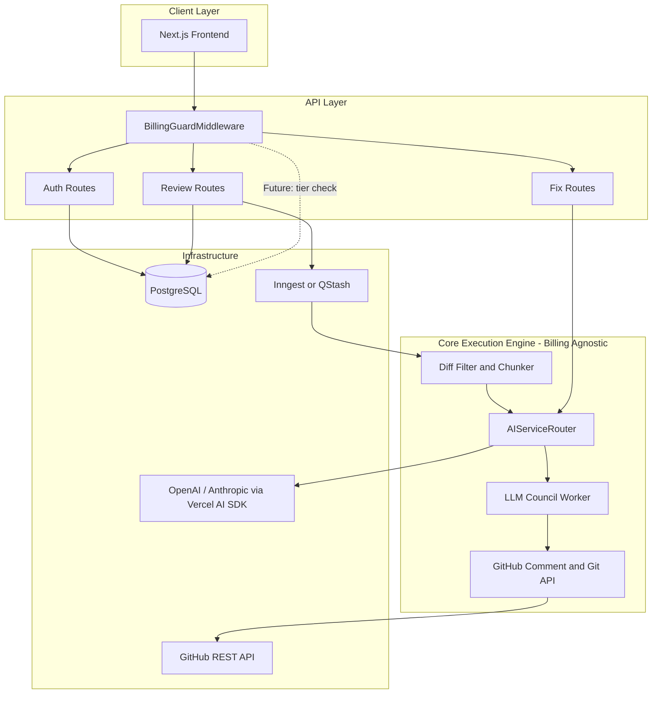
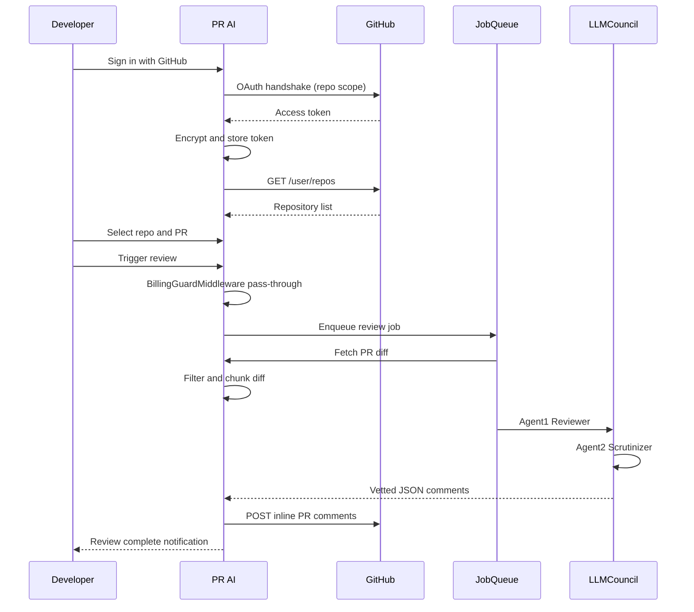
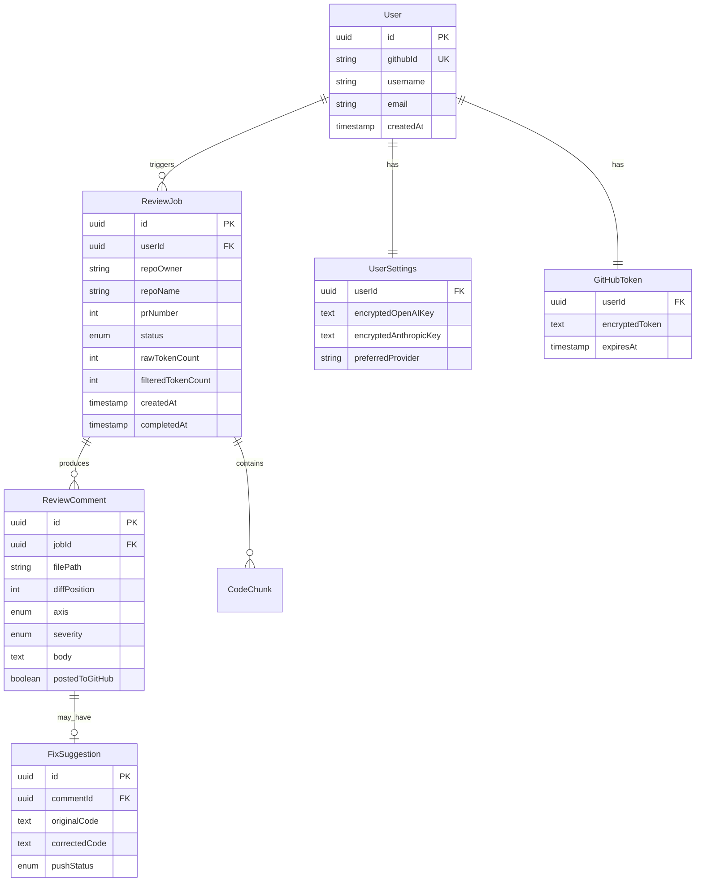
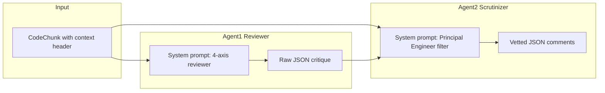

# PR AI — Product Requirements Document (PRD)

**Document Version:** 1.0  
**Status:** Draft  
**Last Updated:** June 15, 2026

---

## 1. Document Overview

### 1.1 Executive Summary

PR AI is a full-stack web application that automates first-pass code review for GitHub pull requests. It integrates with a developer's GitHub account, fetches PR diffs, runs them through a specialized multi-agent AI pipeline (the "LLM Council"), and posts precise, line-level feedback directly into the GitHub PR workspace. Developers can preview AI-suggested fixes and push corrections to their branch with a single click — without the platform ever cloning the repository locally.

The platform is architected with a strict separation between **authentication/billing** and the **core review execution engine**, enabling future subscription and payment integration (e.g., Razorpay) without modifying AI or GitHub integration code.

### 1.2 Problem Statement

| Pain Point | Impact |
|---|---|
| Manual code reviews are slow and inconsistent | PRs sit idle; velocity drops |
| Basic security flaws and performance issues slip through | Production incidents, tech debt |
| Reviewers miss structural edge cases on large diffs | Rework cycles, merge conflicts |
| LLM-based review tools hallucinate or produce low-quality feedback | Developer distrust, noise in PR threads |

### 1.3 Solution Summary

PR AI acts as an intelligent pre-reviewer that:

1. Authenticates via GitHub OAuth with `repo` scope
2. Discovers repositories and PRs, or accepts a direct PR link
3. Optimizes diffs via intelligent filtering and chunking
4. Runs a two-agent critique pipeline across four analysis axes
5. Posts vetted inline comments to GitHub
6. Offers one-click fix generation and low-overhead Git pushes

### 1.4 Product Goals

| Goal | Success Metric (MVP) |
|---|---|
| Reduce time-to-first-review-feedback | Median review posted within 3 minutes of trigger |
| Improve pre-human-review issue detection | ≥70% of flagged security/perf issues confirmed valid by users |
| Minimize LLM cost per review | ≥40% token reduction vs. raw diff ingestion |
| Maintain developer trust | ≤10% comment dismissal rate (marked as false positive) |
| Enable future monetization without refactor | Billing middleware hook in place; zero changes to AI/Git core on activation |

### 1.5 Scope

**In Scope (MVP):**
- GitHub OAuth onboarding and encrypted token storage
- Personal dashboard with repo/PR discovery
- Direct PR link analyzer
- Diff filtering, chunking, and multi-agent review pipeline
- Inline GitHub PR commenting
- "Fix This For Me" preview with Git Data API push
- Pluggable AI key routing (platform default + user BYOK)
- Passive billing guardrail middleware (pass-through)

**Out of Scope (MVP, Future Phases):**
- Razorpay/payment processing and subscription tiers
- GitLab, Bitbucket, or other VCS providers
- Team/org-level accounts and shared billing
- Custom review rule configuration UI
- On-premise or self-hosted deployment
- Local repository cloning on server

### 1.6 Architectural Principles

**Principle 1 — Decoupled Execution Engine:** All AI review logic, chunking, and GitHub write operations live in modules that never import billing or subscription code.

**Principle 2 — Middleware Billing Hook:** Every review-triggering API route passes through `BillingGuardMiddleware`. MVP: pass-through. Future: tier/limit enforcement at this single interception point.

**Principle 3 — Router Abstraction:** No LLM call is made directly from business logic. All calls go through `AIServiceRouter`, which resolves platform vs. user-provided API keys.

**Principle 4 — Async by Default:** Multi-agent review runs in a background job queue to avoid serverless function timeouts.

---

## 2. User Journeys

### 2.1 Onboarding and First Review (Dashboard Path)

### 2.2 Quick Review (Direct PR Link Path)

Developer pastes `https://github.com/{owner}/{repo}/pull/{number}` → regex parser extracts params → same pipeline as dashboard path (Features B and D share backend).

### 2.3 Fix and Push Flow

Developer views fix preview (bad code vs. corrected snippet) → clicks "Commit & Push" → targeted LLM fix request → Git Data API blob/tree/commit sequence → branch updated on GitHub.

---

## 3. Detailed Functional Requirements

Requirements use the format: `[ID] Title — Description | Acceptance Criteria`

---

### 3.1 Authentication and Authorization (AUTH)

| ID | Requirement | Acceptance Criteria |
|---|---|---|
| **AUTH-1** | GitHub OAuth via Auth.js | User can sign in with GitHub; session persisted via Auth.js; sign-out clears session |
| **AUTH-2** | `repo` scope enforcement | OAuth flow requests `repo` scope; token grants read/write on private repos and PR comments |
| **AUTH-3** | Encrypted token storage | GitHub access token stored encrypted at rest in PostgreSQL; never exposed to client |
| **AUTH-4** | Token refresh/re-auth | Expired or revoked tokens surface a re-authentication prompt; no silent failure on API calls |
| **AUTH-5** | Session-protected routes | All dashboard, review, and settings routes require authenticated session |

---

### 3.2 Dashboard and Repository Discovery (DASH / REPO)

| ID | Requirement | Acceptance Criteria |
|---|---|---|
| **DASH-1** | Personal dashboard | Authenticated user sees a dashboard with linked GitHub identity (avatar, username) |
| **REPO-1** | Repository listing | Dashboard fetches and displays user repos via `GET /user/repos`; supports pagination |
| **REPO-2** | Active PR listing | Selecting a repo loads open PRs via `GET /repos/{owner}/{repo}/pulls` |
| **REPO-3** | PR metadata display | Each PR shows title, number, author, branch, and review status |
| **DASH-2** | Review trigger | User can initiate AI review from dashboard for any listed open PR |
| **DASH-3** | Review history | Dashboard shows past reviews with status: queued, in-progress, completed, failed |

---

### 3.3 Direct PR Link Analyzer (PR-LINK)

| ID | Requirement | Acceptance Criteria |
|---|---|---|
| **PR-LINK-1** | PR URL input field | Prominent input accepts GitHub PR URLs on dashboard or dedicated page |
| **PR-LINK-2** | URL parsing | Regex `github.com/{owner}/{repo}/pull/{number}` extracts owner, repo, and PR number |
| **PR-LINK-3** | Validation | Invalid URLs show inline error; valid URLs route to same backend pipeline as DASH-2 |
| **PR-LINK-4** | Access control | User must have repo access via their OAuth token; unauthorized repos return 403 with clear message |

---

### 3.4 Token Optimization and Chunking (CHUNK)

| ID | Requirement | Acceptance Criteria |
|---|---|---|
| **CHUNK-1** | The Ignorer — file filtering | Automatically excludes from diff payload: lockfiles (`package-lock.json`, `yarn.lock`, `pnpm-lock.yaml`), config files (`.env*`, `*.config.js`), markdown, binary/assets |
| **CHUNK-2** | Ignorer configurability | Ignored patterns defined in server-side config; extensible without UI in MVP |
| **CHUNK-3** | The Chunker — size splitting | Files exceeding threshold split into 150–200 line fragments |
| **CHUNK-4** | Structural boundary respect | Chunks split at function/class boundaries, not arbitrary line cuts |
| **CHUNK-5** | Context headers | Each chunk includes localized header context (file path, enclosing function/class name, line range) |
| **CHUNK-6** | Token metrics logging | Per-review log of raw vs. filtered vs. chunked token counts for cost monitoring |

---

### 3.5 LLM Council — Multi-Agent Review (AI-CORE)

| ID | Requirement | Acceptance Criteria |
|---|---|---|
| **AI-CORE-1** | Four-axis analysis | Every review covers: Security, Performance, Code Quality, Test Suggestions |
| **AI-CORE-2** | Agent 1 — The Reviewer | Receives code chunks; outputs raw critique mapped to 4 axes in structured JSON |
| **AI-CORE-3** | Agent 2 — The Scrutinizer | Receives original chunk + Agent 1 output; filters false positives, corrects errors, refines tone |
| **AI-CORE-4** | Vetted output schema | Scrutinizer output is JSON array: `{ filePath, diffPosition, axis, severity, body }` |
| **AI-CORE-5** | Async execution | Full council pipeline runs in background worker (Inngest or QStash); API returns job ID immediately |
| **AI-CORE-6** | Job status tracking | Review job statuses persisted: `queued` → `chunking` → `reviewing` → `scrutinizing` → `posting` → `completed` / `failed` |
| **AI-CORE-7** | Failure handling | Failed agent calls retry up to 3 times with exponential backoff; permanent failure logged with error detail |
| **AI-CORE-8** | Empty diff handling | PRs with no reviewable diff (all ignored files) complete gracefully with informational message |

---

### 3.6 GitHub Inline Commenting (GH-COMMENT)

| ID | Requirement | Acceptance Criteria |
|---|---|---|
| **GH-COMMENT-1** | Inline comment posting | Approved comments posted to correct file and line via GitHub PR comments API |
| **GH-COMMENT-2** | Diff position mapping | `diffPosition` from AI output correctly mapped to GitHub's diff position index |
| **GH-COMMENT-3** | Batch posting | Server loops through comment array; partial failures reported without losing successful posts |
| **GH-COMMENT-4** | Comment attribution | Comments posted under authenticated user's GitHub identity or a designated bot account (TBD) |
| **GH-COMMENT-5** | Rate limit handling | GitHub API rate limits respected; 429 responses trigger queued retry |

---

### 3.7 Fix This For Me (FIX)

| ID | Requirement | Acceptance Criteria |
|---|---|---|
| **FIX-1** | Side-by-side preview | Dashboard shows original code snippet alongside AI-corrected snippet |
| **FIX-2** | Targeted fix generation | Fix LLM request receives only the flagged snippet + specific critique; returns corrected code block only |
| **FIX-3** | Commit and Push button | One-click action triggers Git Data API sequence without local clone |
| **FIX-4** | Git Data API flow | Sequence: (1) fetch blob SHA, (2) `POST /git/blobs`, (3) `PUT /contents/{path}` with new blob and commit message |
| **FIX-5** | Commit message | Auto-generated commit message references PR AI and the fix axis (e.g., `fix(review): address security finding in auth.ts`) |
| **FIX-6** | Conflict detection | If file SHA changed since review, push fails with clear "file modified" message; no force push |
| **FIX-7** | Fix confirmation | User must confirm before push; no silent commits |

---

### 3.8 AI Service Router (AI-ROUTER)

| ID | Requirement | Acceptance Criteria |
|---|---|---|
| **AI-ROUTER-1** | Central router class | `AIServiceRouter` is the sole entry point for all LLM calls in core engine |
| **AI-ROUTER-2** | Platform default tier | Users without custom keys use platform-funded Codex/OpenAI fallback key |
| **AI-ROUTER-3** | BYOK support | Users can store personal OpenAI or Anthropic API keys in account settings |
| **AI-ROUTER-4** | Dynamic instantiation | Router reads user settings; if custom key present, instantiates Vercel AI SDK with user key; else platform key |
| **AI-ROUTER-5** | Key encryption | User-provided API keys encrypted at rest; never returned to client after initial save |
| **AI-ROUTER-6** | Provider selection | Settings allow choosing preferred provider when both keys present (OpenAI vs. Anthropic) |
| **AI-ROUTER-7** | No direct LLM calls | Lint/architecture rule: core engine modules must not import LLM SDK directly — only via router |

---

### 3.9 Billing Guardrail Middleware (BILL)

| ID | Requirement | Acceptance Criteria |
|---|---|---|
| **BILL-1** | Middleware interception | All review-triggering API routes pass through `BillingGuardMiddleware` before handler execution |
| **BILL-2** | MVP pass-through | Middleware currently allows all authenticated requests without limit checks |
| **BILL-3** | Future hook contract | Middleware exposes a `checkSubscription(userId): Promise<GuardResult>` interface stub returning `{ allowed: true }` |
| **BILL-4** | Zero core coupling | AI pipeline, chunker, GitHub writer, and fix modules have no import dependency on billing middleware or subscription models |
| **BILL-5** | Extensibility | Future Razorpay integration adds logic only inside middleware and a new `subscriptions` table — no changes to review engine |

---

### 3.10 Account Settings (SETTINGS)

| ID | Requirement | Acceptance Criteria |
|---|---|---|
| **SETTINGS-1** | API key management | User can add, update, and delete OpenAI/Anthropic keys |
| **SETTINGS-2** | Provider preference | User can set default AI provider for reviews |
| **SETTINGS-3** | GitHub connection status | Settings show connected GitHub account and token health |
| **SETTINGS-4** | Disconnect GitHub | User can revoke PR AI's GitHub access and delete stored token |

---

## 4. Technical Stack

| Layer | Technology | Rationale |
|---|---|---|
| **Framework** | Next.js (App Router) | Full-stack serverless APIs, React frontend, edge streaming |
| **Auth** | Auth.js (NextAuth.js) | GitHub OAuth provider; session management |
| **Styling** | Tailwind CSS + shadcn/ui | Rapid, consistent UI with accessible components |
| **Code Display** | react-diff-viewer (primary) or Monaco Editor (fallback) | Side-by-side diff rendering for review and fix preview |
| **Database** | PostgreSQL via Supabase or Neon | Relational storage for users, tokens, reviews, settings |
| **ORM** | Drizzle ORM or Prisma (TBD) | Type-safe database access |
| **Background Jobs** | Inngest or Upstash QStash | Long-running multi-agent pipeline without serverless timeout |
| **AI Orchestration** | Vercel AI SDK | Universal wrapper for OpenAI, Anthropic; streaming support |
| **Encryption** | Node.js `crypto` (AES-256-GCM) or Supabase Vault | Token and API key encryption at rest |
| **Deployment** | Vercel (recommended) | Native Next.js hosting; edge functions; env var management |

---

## 5. Data Model (Core Entities)

---

## 6. API Route Structure (High Level)

| Method | Route | Middleware | Purpose |
|---|---|---|---|
| `GET/POST` | `/api/auth/[...nextauth]` | — | Auth.js OAuth |
| `GET` | `/api/repos` | Auth | List user repos |
| `GET` | `/api/repos/[owner]/[repo]/pulls` | Auth | List PRs |
| `POST` | `/api/review` | Auth + BILL | Trigger review (dashboard or PR link) |
| `GET` | `/api/review/[jobId]` | Auth | Poll review status |
| `GET` | `/api/review/[jobId]/comments` | Auth | Fetch review comments |
| `POST` | `/api/fix/[commentId]/push` | Auth + BILL | Commit and push fix |
| `GET/PUT` | `/api/settings` | Auth | Manage BYOK keys and preferences |
| `POST` | `/api/inngest` or `/api/qstash` | Webhook sig | Background job handler |

---

## 7. Non-Functional Requirements

### 7.1 Performance (NFR-PERF)

| ID | Requirement | Target |
|---|---|---|
| **NFR-PERF-1** | Review job enqueue latency | < 500ms from trigger to job queued |
| **NFR-PERF-2** | End-to-end review (median PR, <500 LOC changed) | < 3 minutes |
| **NFR-PERF-3** | Dashboard repo load | < 2 seconds for first 30 repos |
| **NFR-PERF-4** | Fix preview generation | < 10 seconds per snippet |
| **NFR-PERF-5** | Token reduction via chunking | ≥ 40% reduction vs. raw diff on typical PRs |

### 7.2 Security (NFR-SEC)

| ID | Requirement | Target |
|---|---|---|
| **NFR-SEC-1** | Token encryption | AES-256-GCM for GitHub tokens and user API keys at rest |
| **NFR-SEC-2** | No token leakage | Tokens never sent to client, logs, or LLM prompts |
| **NFR-SEC-3** | CSRF protection | Auth.js built-in CSRF; state param on OAuth |
| **NFR-SEC-4** | Input sanitization | PR URLs validated via regex; no SSRF via user input |
| **NFR-SEC-5** | Least privilege | OAuth scopes limited to `repo` (no admin, no delete) |
| **NFR-SEC-6** | Rate limiting | Per-user rate limits on review triggers (e.g., 10/hour MVP) |

### 7.3 Reliability (NFR-REL)

| ID | Requirement | Target |
|---|---|---|
| **NFR-REL-1** | Job retry | 3 retries with exponential backoff on transient LLM/GitHub failures |
| **NFR-REL-2** | Idempotent review triggers | Re-triggering same PR creates new job; does not duplicate-post comments without dedup check |
| **NFR-REL-3** | Graceful degradation | If Agent 2 fails, fall back to Agent 1 output with "unverified" flag |
| **NFR-REL-4** | Uptime target | 99.5% availability for API routes (excluding scheduled maintenance) |

### 7.4 Scalability (NFR-SCALE)

| ID | Requirement | Target |
|---|---|---|
| **NFR-SCALE-1** | Concurrent reviews | Queue handles ≥ 50 concurrent review jobs |
| **NFR-SCALE-2** | Serverless timeout avoidance | No review step runs synchronously in API route; all heavy work in queue |
| **NFR-SCALE-3** | Database connection pooling | Use Supabase/Neon pooler for serverless environments |

### 7.5 Observability (NFR-OBS)

| ID | Requirement | Target |
|---|---|---|
| **NFR-OBS-1** | Structured logging | All review jobs log: jobId, userId, repo, token counts, duration, status |
| **NFR-OBS-2** | Error tracking | Integration with Sentry or equivalent for unhandled exceptions |
| **NFR-OBS-3** | Cost tracking | Per-job LLM token usage and estimated cost logged |

### 7.6 Usability (NFR-UX)

| ID | Requirement | Target |
|---|---|---|
| **NFR-UX-1** | Onboarding flow | First review completable within 2 minutes of sign-up |
| **NFR-UX-2** | Review status visibility | Real-time or polling-based status updates on dashboard |
| **NFR-UX-3** | Error messages | All user-facing errors are actionable (e.g., "Re-authenticate GitHub" not "401") |
| **NFR-UX-4** | Responsive design | Dashboard functional on desktop and tablet (mobile: read-only acceptable for MVP) |

### 7.7 Maintainability (NFR-MAINT)

| ID | Requirement | Target |
|---|---|---|
| **NFR-MAINT-1** | Module boundaries | Core engine, auth, billing middleware, and UI are separate packages/modules |
| **NFR-MAINT-2** | Billing decoupling | Adding Razorpay requires changes only in `billing/` module and middleware — zero changes in `core/` |
| **NFR-MAINT-3** | Type safety | End-to-end TypeScript; shared types for review JSON schema |

---

## 8. LLM Council — Agent Prompt Architecture

**Agent 1 (Reviewer) System Prompt Directives:**
- Analyze code against Security, Performance, Code Quality, Test Suggestions
- Output structured JSON only; no prose outside JSON
- Reference specific lines and patterns; no generic advice
- Flag severity: `critical`, `warning`, `info`

**Agent 2 (Scrutinizer) System Prompt Directives:**
- You are a Principal Engineer reviewing a junior reviewer's output
- Remove false positives and hallucinated issues
- Correct factual errors about the code
- Refine tone to be constructive and specific
- Output only validated comments in final JSON schema

---

## 9. Future Phase: Payment Integration (Reference Only)

Not in MVP scope. Architecture pre-positioned via BILL-1 through BILL-5.

| Future ID | Requirement |
|---|---|
| **BILL-FUTURE-1** | Razorpay subscription plans: Free (platform key, N reviews/month), Pro (BYOK + unlimited), Team (shared billing) |
| **BILL-FUTURE-2** | Middleware `checkSubscription()` enforces tier limits before review enqueue |
| **BILL-FUTURE-3** | `subscriptions` table: userId, planId, status, razorpaySubId, currentPeriodEnd |
| **BILL-FUTURE-4** | Usage metering table: userId, reviewCount, periodStart for quota tracking |

---

## 10. Risks and Mitigations

| Risk | Likelihood | Impact | Mitigation |
|---|---|---|---|
| LLM hallucinations in comments | Medium | High | Two-agent Scrutinizer pipeline (AI-CORE-3) |
| GitHub API rate limits | Medium | Medium | Queue with backoff (GH-COMMENT-5); cache repo lists |
| Serverless timeout on large PRs | High | High | Mandatory async queue (AI-CORE-5) |
| Platform AI key cost overrun | Medium | High | Chunking (CHUNK), per-user rate limits (NFR-SEC-6), BYOK (AI-ROUTER-3) |
| Token security breach | Low | Critical | Encryption at rest (NFR-SEC-1); no client exposure (NFR-SEC-2) |
| Billing refactor breaks core | Low | High | Strict middleware hook architecture (BILL-4) |

---

## 11. MVP Milestones

| Phase | Deliverables | Requirements Covered |
|---|---|---|
| **M1: Foundation** | Auth, DB schema, dashboard shell | AUTH-1–5, DASH-1, SETTINGS-3 |
| **M2: GitHub Integration** | Repo/PR discovery, PR link parser | REPO-1–3, PR-LINK-1–4, DASH-2 |
| **M3: Review Engine** | Chunker, LLM Council, queue, inline comments | CHUNK-1–6, AI-CORE-1–8, GH-COMMENT-1–5, AI-ROUTER-1–7 |
| **M4: Fix and Push** | Fix preview, Git Data API push | FIX-1–7 |
| **M5: Guardrails and Polish** | Billing middleware stub, rate limits, observability | BILL-1–5, NFR-SEC-6, NFR-OBS-1–3 |

---

## 12. Open Questions

1. **Comment attribution:** Post comments as the authenticated user or a dedicated PR AI GitHub App bot?
2. **ORM choice:** Drizzle vs. Prisma — team preference?
3. **Queue choice:** Inngest vs. QStash — based on Vercel deployment and team familiarity?
4. **Default LLM model:** Which model(s) for Agent 1 and Agent 2 on platform tier (GPT-4o, Claude 3.5 Sonnet)?
5. **Duplicate review handling:** Should re-triggering a review on the same PR deduplicate existing PR AI comments or post fresh ones?
